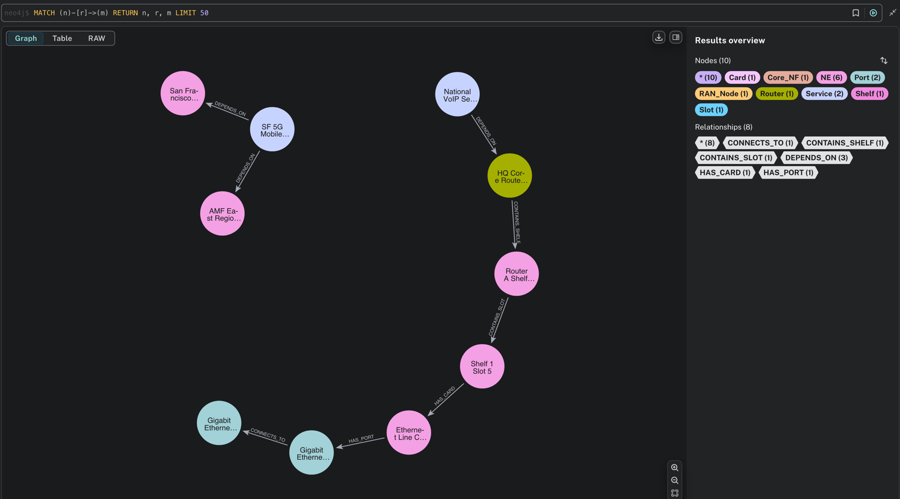
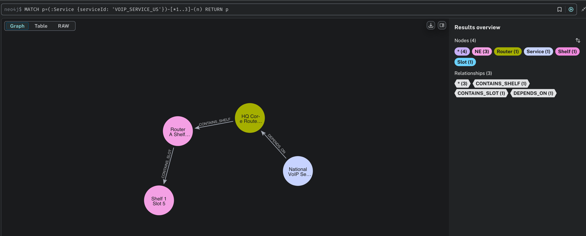
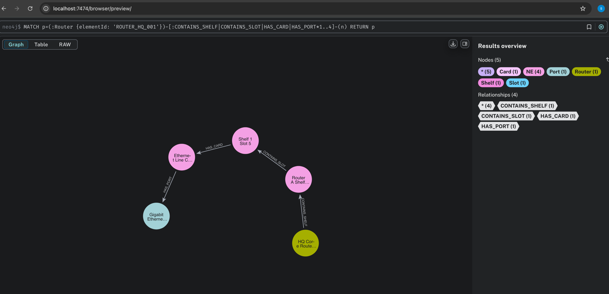

# Network Topology & Impact Analysis Engine


## Project Overview

This project is a Spring Boot microservice designed to model a complex telecommunications network topology using Neo4j, a graph database. It demonstrates capabilities for **impact analysis** (identifying affected services when a network element fails) and **root cause analysis** (tracing issues from a degraded service back to potential failing network elements).

Built with a focus on demonstrating skills relevant to **Principal Engineer/Architect roles** in the telecom domain, leveraging graph database strengths for correlation and analytics in a service assurance context.

## Key Features

* **Graph Data Model:** Represents diverse network elements (Routers, Shelves, Cards, Ports, RAN Nodes, Core Network Functions) and their intricate relationships (containment, connectivity, service dependencies).
* **Data Seeding:** Automatically populates the Neo4j database with sample Verizon-like wireline and wireless network data upon application startup.
* **RESTful APIs:** Exposes endpoints for:
    * Retrieving network elements.
    * Performing **Impact Analysis**: Given a network element ID, determine all downstream services that would be affected by its failure.
    * Performing **Root Cause Analysis**: Given a service ID, trace back dependencies to identify potential network elements causing the issue.
* **Neo4j Integration:** Seamless integration with Neo4j using Spring Data Neo4j and custom Cypher queries via `Neo4jClient`.
* **Dockerization:** Neo4j database runs in a Docker container for easy setup and portability, showcasing containerization skills.
* **Swagger UI:** Provides interactive API documentation for easy exploration and testing of endpoints.

## Technical Stack

* **Backend:** Java 17, Spring Boot 3.5.4, Spring Data Neo4j
* **Database:** Neo4j (Graph Database)
* **Containerization:** Docker
* **API Documentation:** Springdoc OpenAPI (Swagger UI)
* **Build Tool:** Maven
* **Utility:** Lombok
* **Logging:** SLF4J/Logback

## Getting Started

Follow these steps to set up and run the project locally.

### Prerequisites

* Java 17 (JDK)
* Docker Desktop (or Docker Engine) installed and running.
* Maven (usually bundled with IDEs like IntelliJ IDEA)

### 1. Clone the Repository

```bash
git clone [https://github.com/yazhsiva/network-topology-analyzer.git](https://github.com/yazhsiva/network-topology-analyzer.git)
cd network-topology-analyzer
```

### 2. Start the Neo4j Database with Docker
Ensure your Docker daemon is running. Open your terminal in the project root and execute:

```Bash

docker run \
--name network-analyzer-neo4j \
-p 7474:7474 -p 7687:7687 \
-e NEO4J_AUTH=neo4j/password \
neo4j:latest
```
Wait for Neo4j to start (you'll see "Started." in the Docker logs). You can verify it's running by visiting http://localhost:7474 and logging in with neo4j/password.

### 3. Configure Application Properties
The application is pre-configured to connect to the Dockerized Neo4j instance.
Verify src/main/resources/application.properties:

Properties

spring.application.name=network-topology-analyzer
spring.neo4j.uri=bolt://localhost:7687
spring.neo4j.authentication.username=neo4j
spring.neo4j.authentication.password=password
spring.jpa.open-in-view=false # Recommended for Spring Data Neo4j

### 4. Run the Spring Boot Application
You can run the application using your IDE (e.g., IntelliJ IDEA, VS Code with Spring Boot extensions) or via Maven.

### Option A: Using an IDE (Recommended)
Open the project in IntelliJ IDEA.

Navigate to src/main/java/com/verizon/netinventory/topology/NetworkTopologyAnalyzerApplication.java.

Right-click and select "Run 'NetworkTopologyAnalyzerApplication.main()'".

Option B: Using Maven Command Line
In your terminal (from the project root), run:

``` Bash

mvn spring-boot:run
```
The application will start, and the TopologySeedingService will automatically populate the Neo4j database with sample network data. Monitor the console for "Neo4j topology data seeding complete." message.

### 5. Explore the APIs (Swagger UI)
Once the application is running, open your web browser and go to:
http://localhost:8080/swagger-ui.html

You can use the interactive Swagger UI to test the following endpoints:

GET /api/topology/elements: Retrieve all network elements.

GET /api/topology/elements/{elementId}: Get details of a specific element (e.g., ROUTER_HQ_001).

GET /api/topology/analysis/impact/{elementId}: Find services impacted by a failing element (e.g., ROUTER_HQ_001, CARD_ETH_001, PORT_RA_GE0/0/1).

GET /api/topology/analysis/rootcause/{serviceId}: Find root cause elements for an impacted service (e.g., VOIP_SERVICE_US, MOBILE_DATA_SERVICE_SF).

### 6. Stop the Docker Container
When you're done, stop the Neo4j container to free up resources:

```Bash

docker stop network-analyzer-neo4j
docker rm network-analyzer-neo4j # Optional: removes the container
```

## Visualizations

Here are some visual representations of the network topology and relationships within Neo4j.

### Overall Network Graph (Partial View)
A high-level view showing various network elements and their interconnections.


### Service Dependency Example: National VoIP Service
Tracing the dependencies of the National VoIP Service on underlying network elements.


### Wireline Hierarchy Example: Router Component Breakdown
Detailed view of a Router's internal components (Shelf, Slot, Card, Port).


### Data Model (Simplified View)
The graph data model captures key network entities and their relationships:

Nodes (Examples):

:NE (abstract base label): Router, Shelf, Slot, Card, Circuit, RAN_Node, Core_NF

:Port

:Service

:Alarm

Relationships (Examples):

-[:CONTAINS_SHELF]-> (NE -> Shelf)

-[:CONTAINS_SLOT]-> (Shelf -> Slot)

-[:HAS_CARD]-> (Slot -> Card)

-[:HAS_PORT]-> (Card -> Port)

-[:CONNECTS_TO]-> (Port -> Port)

-[:DEPENDS_ON]-> (Service -> NetworkElement)

-[:HAS_SECTOR]-> (RAN_Node -> Sector)

-[:USES_BACKHAUL]-> (RAN_Node -> Backhaul)

-[:RAISES_ALARM]-> (NE -> Alarm)

Contribution
Feel free to fork the repository, open issues, or submit pull requests.

Developed by Siva Saravanan.
LinkedIn: https://www.linkedin.com/in/sivasaravanan-dataeng